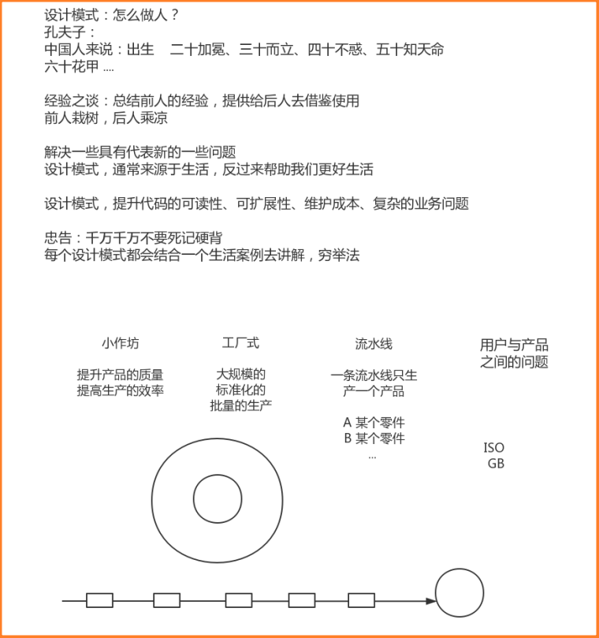
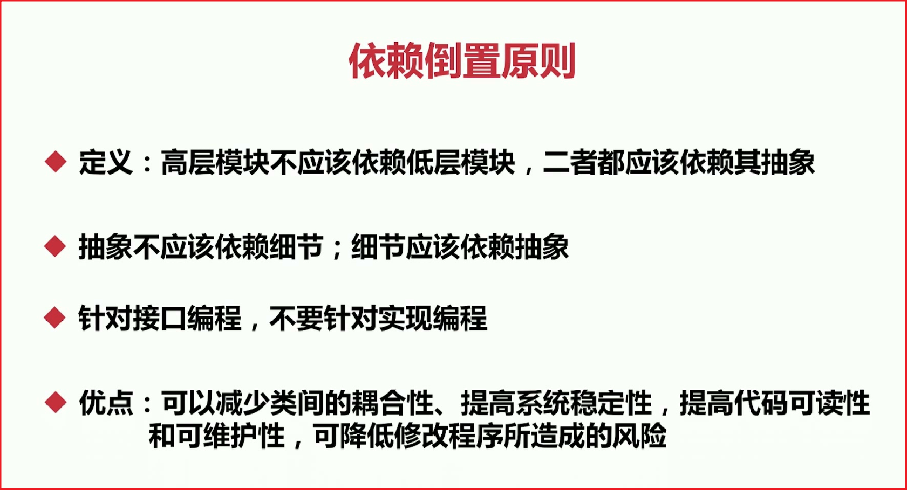
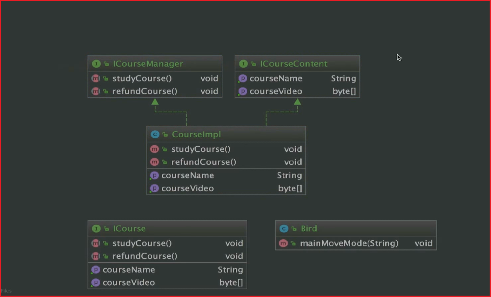

# Java设计模式学习
> 用于3刷Java设计模式。
>
> 在我们学习设计模式的时候,一定要快速转变我们的**在代码编写中的角色**,就拿工厂模式为例,在编写工厂类代码的时候,我们的角色就是工厂。而通过工厂获取到我们想要的内容时,我们就是用户。

## 设计模式学习概览

根据上图我们可以知道,设计模式真正的本质就是,**前人总结的经验,提供给后人去借鉴使用。**

### 关于开闭原则的一点前置知识

不是说只要代码带动了就叫"修改了代码"。开闭原则指的是在改变源头(比如某个工具类)时,以前的老代码无需进行修改。新代码直接用新的内容就行了。这样就符合了开闭原则就是说对扩展开放，对修改关闭。扩展api,对老代码的修改关闭、屏蔽。换一个说法就是在我们对自己写的框架api进行升级的时候,只要client(虽然这种场景下很有可能就是我们)的代码没有改变,那么就是符合开闭原则的。切记在玩Java设计模式的时候角色的转变!

站在使用api客户的角度来讲,框架api升级后,原有代码并没有改动,只是用户可以使用新增的api接口了。

## UML

###UML类图的一点分析

组合关系为强联系。关联关系为弱联系。

依赖关系是虚线箭头,表示弱关系,一般用于参数和返回值有关系的情况下。

关联关系是实线箭头,表示强关系,一般用于某个对象中有另外一个

至于类与父类或接口的指向问题,以为只有子类知道他的父类是谁,所以肯定是子类指向父类,因为父类没有办法去指向子类(java集成的特性决定了)。

###UML时序图

这里今后再做补充。

## 7大设计原则

首先指出,设计原则不是强行遵守的,而是要讲究一个度,讲究一个平衡,讲究一个取舍。

### 开闭原则

**实现开闭原则的核心就是面向抽象编程。**而不是面向具体的实现编程。因为抽象相对是稳定的,让类去依赖与稳定的抽象,所以对于修改来说就是封闭的,而通过面向对象的继承以及多态的机制,就可以实现对抽象体的继承了,通过重写改变其固有方法,或者实现新的扩展方法,当变化发生时,我们可以创建抽象来隔离以后可能发生的变化。

开闭原则的就是用抽象来创建框架,用实现来扩展细节。

我们在写代码时应该注意,越低层次的模块、越基础的模块发生变化影响的范围是越大的。越高层的模块变化影响的范围会越小。简单的理解,如果我们一个dao层发生变化,那我们的影响就会非常巨大,比如这次试用mybatis-plus与activiti在一开始的思路中,想要更换dao层,那工作量可想真的是非常巨大了。如果不遵守开闭原则,那么我们在修改a模块的时候,很可能就会影响b模块。就比如我们要改dao层,那么service与controller都很有可能收到影响!

在课程中,通过继承的方式,是的我们对代码的修改是关闭的对扩展是开放的。

### 依赖倒置原则

还需要一个注意点,应用程序的代码肯定是有改变的,所有的设计原则最好不应该把应用层的代码拿出来考虑(当然了如果,如果在测试的时候,只要应用层和底层类,那么把应用层当成高层调用底层也是没问题的,毕竟高层调用底层就是一个对的概念)。

在依赖倒置原则中,"高层模块不应该依赖底层模块",这句话中,高层次与低层次都是相对而言的,一般来讲我们是不需要考虑应用层的设计模式,这部分肯定是要经常变得。我们在研究设计模式都是针对非应用层的代码而言的。

"两者都应该依赖其抽象"这句话的意思是,假设有接口I、类A(实现接口I)、类B(依赖或关联类A),其中类B在依赖不倒置的情况下,应该是依赖或关系A的。但是在依赖倒置的情况下,要求类A实现I,B与I建立关系或依赖,这样就保证了"二者都应该依赖其抽象",这里的抽象就是接口I。

因为接口作为契约是相对稳定的,并且A与B是没有任何依赖关系的,他们都是依赖于接口I,这样就保证了代码的低耦合,可以降低修改程序所造成的风险。

我们指定接口就是为了规范或契约,接口的改动是需要认真考虑的,具体的实现交给具体的实现类。

依赖倒置原则,总能分解成一个接口与两个类的关系,在今后的学习中要多分解问题来发现或书写符合依赖倒置原则的代码。**(这句话的正确性有待在未来的工作或学习中进行检验,现在我的认知这样子是没错的)**

依赖导致原则的核心还是面向抽象变成。

### 单一职责原则

接口级别的单一职责原则,如图,单一职责原则,绝对不是说一个类或一个接口只有一个方法,而是说一个类或一个方法只有一个类型的的方法或内容。

---

方法级别的单一职责原则就比较简单了,一个方法一个功能。比如这个方法是用来更新某个表的操作,那个方法是用来做删除某个表的操作。

一般我们看到的这种情况,传递boolean的时候就可以考虑使用单一职责原则进行拆分,但是有时候拆的太细不是件好事(比如一开始我将曲江评估系统企业端分为了4个maven模块就显得更麻烦了),是否要用单一职责原则是一个仁者见仁智者见智的事情,主要还是思想的高度决定能不能用好!

如果在只在类的层面严格执行单一职责原则,那么可能会导致类暴多。**所以总结起来,在实际的开发中我们的借口和方法一定要做到单一职责(在同类方法的高度层面,大约是2层高度吧),这样子对于我们维护是比较方便的,同时成本也非常的低,**类的单一职责遵循这情况,就看实际的项目情况了